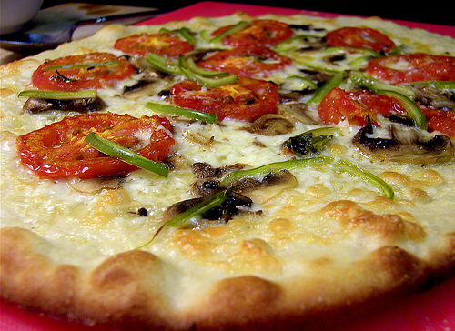

About
=====

Authors
-------

.. include:: ../AUTHORS.rst

.. _`apache2`:

License
-------

ics.py is under the Apache 2 software license because… bah! Why not?

.. include:: ../LICENSE

Inspiration
-----------
Thanks to:
	- `arrow <http://crsmithdev.com/arrow/>`_ which provides a nice API for dates, times and deltas,
	- `python-dateutil <http://labix.org/python-dateutil>`_ for parsing timezones from VTIMEZONE blocks,
	- `requests <http://python-requests.org/>`_ for giving me inspiration from it's beautiful and pythonic API (and it's doc too),
	- `six <http://pythonhosted.org/six/>`_ to make the python3 transition easier,
	- `#urlab <irc://freenode.org#urlab>`_ for help and advices.

Contribute
----------

.. include:: ../CONTRIBUTE.rst

Misc
----
Here is a pizza for you!

(`Source <https://secure.flickr.com/photos/rdpeyton/3495871394/>`_  ©rdpeyton, CC by-nc-sa)
